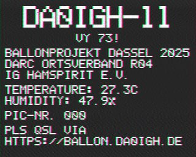
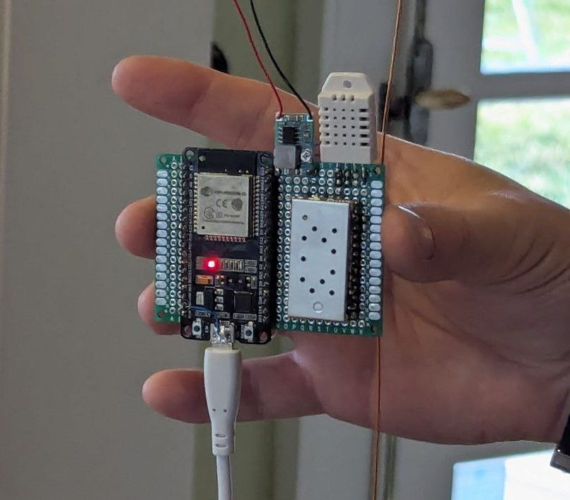

# ESP32 SA818 SSTV & Morse Transmitter with DHT22 & Custom Font 📡🌡️

Dieses Projekt implementiert einen multifunktionalen Transmitter auf Basis des ESP32, der folgende Funktionen bereitstellt:

- **SSTV-Bildübertragung (Martin M1-Modus):**  
  Es wird ein Graustufenbild (320×256 Pixel) in einem statischen Bildpuffer erzeugt.  
  Das Bild enthält vordefinierte Texte:  
  - Oben in großer Schrift (Scale 5) das Rufzeichen **"DA0IGH-11"**  
  - Direkt darunter in halber Höhe (Scale 2) zentriert **"VY 73!"**  
  - Weitere Zeilen mit:
    - **"BALLONPROJEKT DASSEL 2025"**  
    - **"DARC ORTSVERBAND R04"**  
    - **"IG HAMSPIRIT E.V."**  
    - Sensordaten vom DHT22:
      - **"TEMPERATURE: X.XC"**
      - **"HUMIDITY: X.X%"**
    - Ein Bildzähler, der als **"PIC-NR. XXX"** formatiert wird  
    - Am unteren Rand werden noch zwei Zeilen ausgegeben:
      - **"PLS QSL VIA"**
      - **"HTTPS://BALLON.DA0IGH.DE"**

- **Morseübertragung:**  
  Zwischen den SSTV-Sendungen wird das Rufzeichen **"DA0IGH"** in Morse-Code (bei ca. 15 WPM) gesendet.  
  Die Morse-Funktion wandelt Buchstaben mithilfe eines einfachen Mappings in Morsezeichen um und generiert Töne, indem sie die LEDC-Frequenz temporär auf 1900 Hz einstellt.

- **SA818 FM Transmitter Konfiguration über RS232:**  
  Im Setup wird der SA818 über Serial1 (9600 Baud) konfiguriert. Gesendete Befehle sind:  
  - `AT+VERSION` (Abfrage der Modulversion)  
  - `AT+DMOCONNECT` (Handshake)  
  - `AT+DMOSETGROUP=0,144.5000,144.5000,0000,0,0000` (Frequenzeinstellung auf 144,5000 MHz)

- **Voice-Modus (optional):**  
  Ein optionaler Sprachmodus liest das Mikrofonsignal (über einen ADC-Pin) und gibt es per PWM an den SA818 weiter.  
  Dabei wird der PTT-Pin aktiviert und das Mikrofoneingangssignal über LEDC ausgegeben.

## Hardware

### Benötigte Komponenten

- ESP32 (z. B. ESP32-WROOM‑32)
- SA818 FM Transmitter Modul
- DHT22 Sensor (Temperatur und Luftfeuchtigkeit)
- Mikrofon (mit passender Schaltung für ADC; ggf. Verstärkung)
- RS232-Levelshifter (falls erforderlich)
- Diverse Kabel und Breadboard

### Beispiel-Pinout

- **DHT22:**  
  - Data: **GPIO4**  
  - VCC: 3.3V  
  - GND: GND

- **SA818 (RS232):**  
  - TX (ESP → SA818): **GPIO16**  
  - RX (SA818 → ESP): **GPIO15**

- **SA818 PTT:**  
  - PTT: **GPIO13** (HIGH = Senden)

- **Mikrofon:**  
  - MIC: **GPIO14** (ADC-Eingang)

- **Audioausgang (für SA818 Audio):**  
  - AUDIO_OUT: **GPIO25** (LEDC-PWM-Ausgang)

## Software

### Verwendete Bibliotheken

- **DHT Sensor Library** – Für die Kommunikation mit dem DHT22  
- **driver/ledc.h** – Für die LEDC (PWM) Konfiguration (SSTV, Voice und Morse)  
- **sin256.h** – Enthält eine Sinustabelle, die im SSTV-Modus verwendet wird

### Code-Struktur

- **SSTV-Bildmodus:**  
  Das Bild wird in einem statischen Graustufenpuffer erstellt. Über eine benutzerdefinierte 5×7-Font (mit Skalierung) werden Texte in den Puffer gezeichnet. Anschließend wird das Bild im Martin M1‑Modus übertragen.

- **Morsemodus:**  
  Die Funktion `sendMorse()` wandelt den Text "DA0IGH" in Morsezeichen um und sendet diese über LEDC (temporäre Frequenz von 1900 Hz) bei ca. 15 WPM.

- **SA818 Konfiguration:**  
  Im Setup werden über Serial1 nacheinander die Befehle `AT+VERSION`, `AT+DMOCONNECT` und `AT+DMOSETGROUP=0,144.5000,144.5000,0000,0,0000` an den SA818 gesendet.

- **Voice-Modus (optional):**  
  Die Funktion `transmitVoice()` aktiviert den PTT-Pin, liest das Mikrofonsignal (ADC) und gibt dieses per PWM an den SA818 weiter (Audioausgang an GPIO25).

## Aufbau & Flashen

1. **Bibliotheken installieren:**  
   Stelle sicher, dass die DHT Sensor Library und andere benötigte Bibliotheken installiert sind.

2. **ESP32 Board wählen:**  
   Wähle in der Arduino-IDE das passende ESP32-Boardprofil.

3. **Hardware anschließen:**  
   Verbinde die Komponenten gemäß dem oben beschriebenen Pinout.

4. **Sketch kompilieren und flashen:**  
   Kompiliere den Code und lade ihn auf den ESP32.

## Ablauf

1. **Setup:**  
   - Der ESP32 initialisiert DHT22, RS232 (Serial1) zur SA818-Konfiguration, Timer und LEDC.  
   - Der SA818 wird konfiguriert und es erfolgt eine Überprüfung des DHT22.
   
2. **Loop:**  
   - Zuerst wird der SSTV-Bildmodus aktiviert und das Bild gesendet.  
   - Anschließend wird das Rufzeichen "DA0IGH" in Morse-Code übertragen.  
   - Optional folgt der Voice-Modus, in dem das Mikrofoneingangssignal übertragen wird.
   - Nach einer Wartezeit beginnt der Zyklus erneut.
